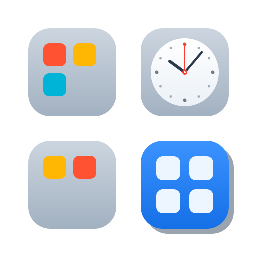
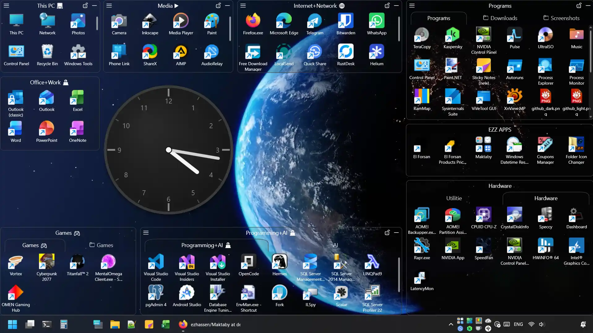
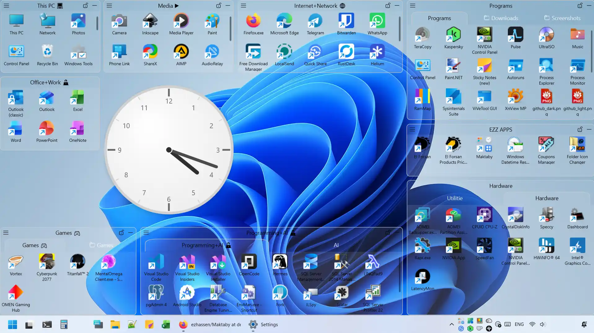
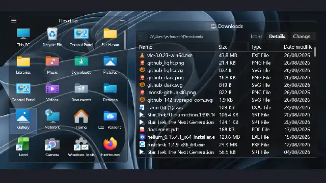
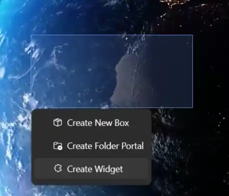
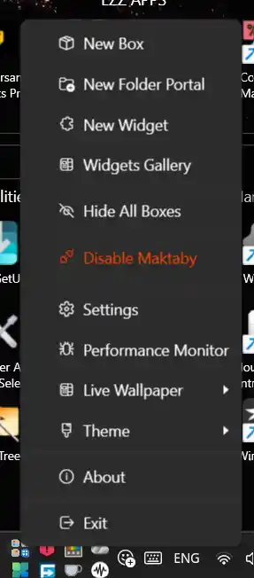
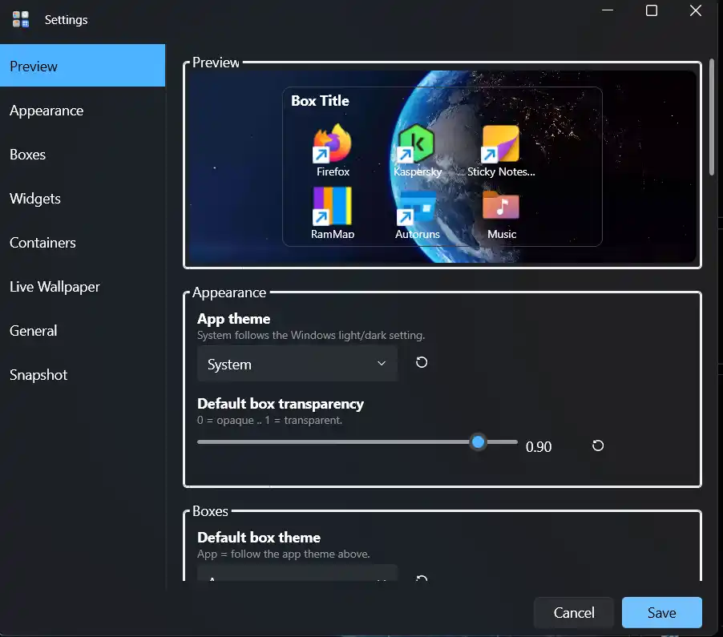

<div align="center">
  
  
  
## Maktaby - Windows Desktop Organizer

[](#-installation)
[](https://github.com/ezhassen/Maktaby/releases)
[](https://github.com/ezhassen/Maktaby/releases)
[](https://github.com/ezhassen/Maktaby/blob/main/LICENSE.txt)
[](https://github.com/ezhassen/Maktaby/actions/workflows/ci.yml)
[](https://github.com/ezhassen/Maktaby/actions/workflows/release.yml)

[**⬇ Download**](https://github.com/ezhassen/Maktaby/releases/latest) · [Features](#-features) · [Screenshots](#-screenshots) · [Installation](#-installation) · [Build from source](#️-build-from-source)
 <!-- to be added [FAQ](https://github.com/ezhassen/Maktaby/blob/main/docs/FAQ.md) · [Changelog](https://github.com/ezhassen/Maktaby/blob/main/docs/CHANGELOG.md) · -->

### Maktaby turns a cluttered Windows desktop into a workspace you actually keep

</div>

Your shortcuts, folders and files are grouped into **resizable, snap-able boxes** that live *above* the desktop instead of being buried in it — so they stay exactly where you put them, and the Windows desktop itself keeps working normally underneath.

On top of that it adds the two things a plain desktop organizer never has:

- **Widgets** — drop an HTML/CSS/JS or a C#/WPF widget onto the desktop for clocks, calendars, weather, notes or anything else you build yourself. Write them in the built-in editor, or install native plugins.
- **Live wallpapers** — set a video or animated GIF as the desktop background, rendered behind the Windows icons with per-monitor support.

Everything runs from the system tray, persists your layout between sessions, and stays out of the way: one double-click on the empty desktop hides every box and gives you a completely clean screen.

> Windows 10 (2004 / build 19041) or later, 64-bit · [.NET 10 Desktop Runtime](https://dotnet.microsoft.com/download/dotnet/10.0) required · **Windows-only, x64**

---

## ✨ Features

### Boxes

| | |
| --- | --- |
| 📦 **Boxes** | Group shortcuts, files and folders into resizable containers that live on your desktop. |
| 🖱️ **Drag & Drop creation** | Drop files from Explorer, the Start Menu or another Box onto empty desktop space to create a new Box automatically. |
| 📐 **Snap & Guides** | Boxes snap to each other and to screen edges with live visual guide lines. |
| 🔄 **Roll-up** | Roll any box into its title-bar strip (Top / Bottom / Left / Right) to reclaim space without losing content. |
| 🏷️ **Tabs** | Multi-tab containers group many items behind a single box. |
| 🎨 **Per-box appearance** | Override transparency, background, foreground, border color and thickness, and title-bar colors per box. Set sensible defaults globally. |
| 📏 **Icon size** | Shortcut icon size inside boxes (16–128 px). Pin a fixed size or let it follow the Windows desktop automatically. |
| 🖼️ **Hide desktop icons** | Toggle Windows desktop icons off/on from the tray menu for a clean look. |

### Widgets

| | |
| --- | --- |
| 🧩 **Web widgets** | Self-contained HTML / CSS / JS widgets placed from a gallery. Each widget gets its own Chromium (WebView2) instance, so they run fully client-side. |
| 🖥️ **Native widgets** | C# (WPF) plugins compiled at load via Roslyn or dropped as a DLL. Host WPF, WinForms, raw HWND, Direct3D11 and SkiaSharp content. Built-ins ship with the app; user widgets live in `%LocalAppData%\Maktaby\UserWidgets`. |
| ⚙️ **Widget settings** | Native plugins can declare settings (string / number / boolean / list) that the host renders as editors and persists per placed widget. |
| 🎨 **Theme-aware widgets** | Web and native widgets can opt into dark / light theme switching. |
| 🔒 **Trust model** | User widgets prompt once per content hash before running — full-trust .NET code, fail-closed on edit. Built-ins are implicitly trusted. |
| 🛠️ **Widget editor** | Create / edit web widgets with HTML, CSS and JS tabs, AvalonEdit syntax highlighting, a live preview pane, network and theme checkboxes, and auto-generated manifest + thumbnail on save. |

### Live Wallpaper

| | |
| --- | --- |
| 🎬 **Live wallpaper** | Set any image, animated GIF or video as your desktop wallpaper. Renders across monitors with layout tracking. |
| 🎞️ **Formats** | Still images, animated GIFs and video files (via the codecs the system provides). |
| 💾 **Preload cache** | Optionally keep up to 1024 MB of video / GIF bytes in shared RAM so playback starts instant on multi-monitor setups. |
| ⏯️ **Play / pause / change / remove** | All managed from the tray menu and the Settings → Live Wallpaper panel. |
| 🔇 **Auto-pause** | Pauses automatically when nothing is visible (all boxes hidden / suspended) to keep idle resource use low. |

### System integration

| | |
| --- | --- |
| 🖥️ **System tray** | Always-on tray icon with the full app menu: new box, new folder portal, widgets, live wallpaper, settings, about, theme, hide-all, enable/disable, exit. |
| 🚀 **Startup** | Optional launch on Windows startup, toggled from the tray. |
| 🔄 **Shell restart recovery** | Survives Explorer restarts: re-registers the tray icon and re-glides the desktop layer automatically. |
| 🪟 **Modern window chrome** | Wpf.Ui FluentWindow base with Mica backdrop, rounded corners, and a shared title bar on every app window. |
| 🌓 **Theming** | Dark / Light / follow-system. App theme, widget theme and per-box overrides are independent. |
| 🎯 **Single instance** | One running copy; a second launch exits silently. |

### Gestures & shortcuts

| Gesture | Action |
| --- | --- |
| Double-click empty desktop | Toggle hide / show all boxes |
| Ctrl + Wheel on desktop | Change icon size |
| Right-click box header | Box menu (delete, hide, lock, roll, tabs) |
| Alt + Enter on an item | Show properties |
| Drag onto empty desktop | Marquee → Create New Box menu |

### Tools

| | |
| --- | --- |
| 📊 **Performance Monitor** | Live dashboard: app process memory / CPU / I/O, managed vs private bytes, GDI & USER handles, WPF render tier, WebView2 process breakdown, per-window widget status (active / suspended, bounds mismatch), and per-monitor live wallpaper state. One-click suspend / resume for widgets and wallpaper. |
| 📋 **Log viewer** | Browse one file per day, reload, follow-tail, and open the log folder — with line numbers and syntax colouring. |
| 🔍 **Debug desktop tree** | Diagnostic overlay that draws, at the cursor, the hit-test result, z-order and the surface window style/ex-style. |
| 💾 **Backups & restore** | Export a `.dbe1` bundle (layout, settings, UserWidgets) and restore it later. Reset is destructive and rebuilds from scratch. |
| 📐 **Snap overlay** | Live snap guide lines when dragging or resizing boxes. |
| 📁 **Folder portal** | A box that opens a chosen folder in Explorer when activated. |

## 📸 Screenshots

<!-- Placeholder screenshots — replace with actual captures -->

### Box with items and widgets

<p align="center">
  
</p>

<p align="center">
  
</p>

<p align="center">
  
</p>

### Marquee → Create New

<p align="center">
  
</p>

### Tray menu

<p align="center">
  
</p>

### Settings

<p align="center">
  
</p>

## 📥 Installation

### Prerequisites

| Requirement | Details |
| --- | --- |
| **Operating system** | Windows 10 version 2004 (build 19041) or later, or Windows 11. The app targets `net10.0-windows10.0.19041.0`. |
| **Architecture** | **x64 only.** The installer is published as `win-x64`; there is no x86 or ARM64 build. (For now. Open issue and tell me if you want it or build from source) |
| **.NET Desktop Runtime** | **.NET 10 Desktop Runtime (x64)** must be installed. The official installer is *framework-dependent*, not self-contained — without it Maktaby will not start. <br>[Download .NET 10 Desktop Runtime (x64)](https://dotnet.microsoft.com/download/dotnet/10.0) |
| **WebView2 Runtime** | **Microsoft Edge WebView2 Evergreen Runtime** is required for web widgets and HTML-based live wallpapers. It ships preinstalled on Windows 11 and on most Windows 10 machines via Edge — if you have removed Edge, install it separately: <br>[Download WebView2 Evergreen Runtime](https://developer.microsoft.com/microsoft-edge/webview2/) |
| **Administrator rights** | The setup installs to `%ProgramFiles%\Maktaby` and requests elevation. |

### Install

1. Download the latest `Maktaby-<version>-x64-setup.exe` from the [releases page](../../releases). ([Download the newest release directly](https://github.com/ezhassen/Maktaby/releases/latest/download/Maktaby-LATEST-x64-setup.exe) — substitute the version in the URL.)
2. Run it and accept the UAC prompt.
3. On the final page, choose whether to **launch Maktaby** and whether to **start it on Windows startup** (both are ticked by default). The installer closes a running instance before updating and reopens it afterwards.
4. The tray icon appears on first launch — that is where the app lives. There is no main window.

Each release also publishes a SHA-256 checksum on the release page.

To uninstall, use **Settings → Apps → Installed apps → Maktaby**. Uninstallation closes any running instance, removes the files, and cleans up the Windows startup entry.

> **Note** — Maktaby layers its own windows *above* the Windows desktop and wallpaper. It does not replace Explorer, and it does not modify your desktop icons, existing files, or registry entries beyond the optional startup key.
---

## 🛠️ Build from source

### Prerequisites

- Windows 10 (19041+) or Windows 11
- [.NET 10 SDK](https://dotnet.microsoft.com/download/dotnet/10.0)

### Build & Run

```powershell
git clone https://github.com/ezhassen/Maktaby.git
cd Maktaby
dotnet run --project src/Maktaby
```

### Create the Installer

```powershell
# Publish + build installer (requires Inno Setup 6 in PATH)
.\build.ps1 -Action Publish
```

Install [Inno Setup 6](https://jrsoftware.org/isinfo.php) first. The script publishes the app to `src/Maktaby/bin/Publish` and compiles `installer.iss` into `Installer/Maktaby <version>.exe`.

### Releasing

Releases are tag-driven: push a `v1.0.33-beta.1` tag from `develop` for a pre-release, or a `v1.0.33` tag from `main` for a stable one. GitHub Actions builds the installer and publishes the release. Automatic version numbering is available via `.\build_publish.ps1`.

Full details: **[docs/releasing.md](docs/releasing.md)**.

## 🤝 Contributing

1. Fork the repo
2. Create a feature branch (`git checkout -b feature/my-feature`)
3. Commit your changes
4. Push and open a Pull Request

Contributions are accepted under the same Apache-2.0 license as the project.

---

## 📄 License

Maktaby is open-source software licensed under the **Apache License 2.0** — you can use, modify, and redistribute it (including commercially), provided you keep the license and state any changes. It comes with **no warranty**, and the authors are not liable for any damages arising from its use.

Full text: [`LICENSE.txt`](LICENSE.txt) · Official terms: [apache.org/licenses/LICENSE-2.0](https://www.apache.org/licenses/LICENSE-2.0)

---

## 📦 Dependencies & Credits

Maktaby stands on the shoulders of some excellent open-source projects. Thank you to everyone who maintains them.

### Runtime & UI

| Package | Version | Used for | Project |
| --- | --- | --- | --- |
| [WPF-UI](https://github.com/wpf-ui/WPF-UI) · [WPF-UI.Tray](https://github.com/wpf-ui/WPF-UI) | 4.3.0 | Fluent window chrome (Mica backdrop, rounded corners), theming, and the system tray icon | `Maktaby`, `Maktaby.Shared`, `Maktaby.WidgetsCreator` |
| [CommunityToolkit.Mvvm](https://github.com/CommunityToolkit/dotnet) | 8.4.2 | MVVM source generators (`[ObservableProperty]`, `[RelayCommand]`) | `Maktaby`, `Maktaby.Shared` |
| [AvalonEdit](https://github.com/icsharpcode/AvalonEdit) | 6.3.1.120 | HTML / CSS / JavaScript syntax highlighting in the widget editor | `Maktaby` |

### Web content

| Package | Version | Used for | Project |
| --- | --- | --- | --- |
| [Microsoft.Web.WebView2](https://github.com/MicrosoftEdge/WebView2Feedback) | 1.0.4191.47 | Chromium host for web widgets and HTML live wallpapers. Requires the [Evergreen Runtime](https://developer.microsoft.com/microsoft-edge/webview2/) at runtime. | `Maktaby`, `Maktaby.Shared`, `Maktaby.LiveWallpaper` |

### Graphics & rendering (live wallpaper engine)

| Package | Version | Used for | Project |
| --- | --- | --- | --- |
| [Vortice.Windows](https://github.com/amerkoleci/Vortice.Windows) — `Direct3D11`, `Direct2D1`, `DirectComposition` | 3.8.3 | Direct3D / Direct2D video and GIF rendering, swapchains, desktop composition layer | `Maktaby.LiveWallpaper` |
| [System.Drawing.Common](https://github.com/dotnet/runtime) | 10.0.12 | Frame extraction and image handling for animated wallpapers | `Maktaby.LiveWallpaper` |
| [Microsoft.Windows.Compatibility](https://github.com/dotnet/runtime) | 10.0.12 | Compatibility shims (Shell/COM interop) | `Maktaby.LiveWallpaper` |

### Widget SDK

| Package | Version | Used for | Project |
| --- | --- | --- | --- |
| [Microsoft.CodeAnalysis.CSharp (Roslyn)](https://github.com/dotnet/roslyn) | 5.9.0 | Compiles C# native-widget sources at load time, with a hashed cache | `Maktaby` |

### Infrastructure

| Package | Version | Used for |
| --- | --- | --- |
| [Microsoft.Extensions.DependencyInjection](https://github.com/dotnet/runtime) | 10.0.12 | Service registration and the composition root |
| [Microsoft.Extensions.Configuration(.Json)](https://github.com/dotnet/runtime) | 10.0.12 | Reading the app settings file |
| [Serilog](https://github.com/serilog/serilog) | 4.4.0 | Structured logging |
| [Serilog.Exceptions](https://github.com/serilog/serilog-exceptions) | 8.4.0 | Rich exception detail in the log |
| [Serilog.Sinks.File](https://github.com/serilog/serilog) | 7.0.0 | Daily rolling log files (viewable in-app) |
| [Serilog.Sinks.Console](https://github.com/serilog/serilog) | 6.1.1 | Debug-build console output |

### Build & packaging

| Tool | Version | Used for |
| --- | --- | --- |
| [MinVer](https://github.com/adamralph/minver) | 8.0.0 | Derives the assembly version from git tags |
| [Inno Setup](https://jrsoftware.org/isinfo.php) | 6 | Builds the setup executable from `installer.iss` |
| [.NET 10 SDK](https://dotnet.microsoft.com/download/dotnet/10.0) | 10.0.x | Build toolchain (`net10.0-windows10.0.19041.0`) |

> All package versions are pinned centrally in [`Directory.Packages.props`](Directory.Packages.props) — that is the single place to bump or add a dependency.
>
> **Native widgets run with full trust.** A native widget is arbitrary .NET code executing inside the app with your privileges, so only install widgets from folders you trust. See [`docs/native-widgets.md`](docs/native-widgets.md) for the trust model.
