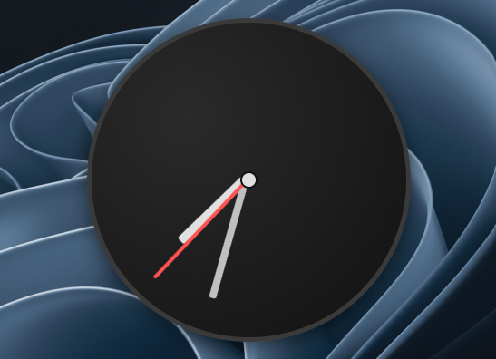

# Maktaby

<p align="center">
  
</p>

Organize your Windows desktop into **resizable, snap-able boxes** that pin your files, folders and app shortcuts above the desktop — so everything stays where you put it.

---

## ✨ Features

### Boxes

| | |
| --- | --- |
| 📦 **Boxes** | Group shortcuts, files and folders into resizable containers that live on your desktop. |
| 🖱️ **Drag & Drop creation** | Drop files from Explorer, the Start Menu or another Box onto empty desktop space to create a new Box automatically. |
| 📐 **Snap & Guides** | Boxes snap to each other and to screen edges with live visual guide lines. |
| 🔄 **Roll-up** | Roll any box into its title-bar strip (Top / Bottom / Left / Right) to reclaim space without losing content. |
| 🏷️ **Tabs** | Multi-tab containers group many items behind a single box. |
| 🎨 **Per-box appearance** | Override transparency, background, foreground, border color and thickness, and title-bar colors per box. Set sensible defaults globally. |
| 📏 **Icon size** | Shortcut icon size inside boxes (16–128 px). Pin a fixed size or let it follow the Windows desktop automatically. |
| 🖼️ **Hide desktop icons** | Toggle Windows desktop icons off/on from the tray menu for a clean look. |

### Widgets

| | |
| --- | --- |
| 🧩 **Web widgets** | Self-contained HTML / CSS / JS widgets placed from a gallery. Each widget gets its own Chromium (WebView2) instance, so they run fully client-side. |
| 🖥️ **Native widgets** | C# (WPF) plugins compiled at load via Roslyn or dropped as a DLL. Host WPF, WinForms, raw HWND, Direct3D11 and SkiaSharp content. Built-ins ship with the app; user widgets live in `%LocalAppData%\Maktaby\UserWidgets`. |
| ⚙️ **Widget settings** | Native plugins can declare settings (string / number / boolean / list) that the host renders as editors and persists per placed widget. |
| 🎨 **Theme-aware widgets** | Web and native widgets can opt into dark / light theme switching. |
| 🔒 **Trust model** | User widgets prompt once per content hash before running — full-trust .NET code, fail-closed on edit. Built-ins are implicitly trusted. |
| 🛠️ **Widget editor** | Create / edit web widgets with HTML, CSS and JS tabs, AvalonEdit syntax highlighting, a live preview pane, network and theme checkboxes, and auto-generated manifest + thumbnail on save. |

### Live Wallpaper

| | |
| --- | --- |
| 🎬 **Live wallpaper** | Set any image, animated GIF or video as your desktop wallpaper. Renders across monitors with layout tracking. |
| 🎞️ **Formats** | Still images, animated GIFs and video files (via the codecs the system provides). |
| 💾 **Preload cache** | Optionally keep up to 1024 MB of video / GIF bytes in shared RAM so playback starts instant on multi-monitor setups. |
| ⏯️ **Play / pause / change / remove** | All managed from the tray menu and the Settings → Live Wallpaper panel. |
| 🔇 **Auto-pause** | Pauses automatically when nothing is visible (all boxes hidden / suspended) to keep idle resource use low. |

### System integration

| | |
| --- | --- |
| 🖥️ **System tray** | Always-on tray icon with the full app menu: new box, new folder portal, widgets, live wallpaper, settings, about, theme, hide-all, enable/disable, exit. |
| 🚀 **Startup** | Optional launch on Windows startup, toggled from the tray. |
| 🔄 **Shell restart recovery** | Survives Explorer restarts: re-registers the tray icon and re-glides the desktop layer automatically. |
| 🪟 **Modern window chrome** | Wpf.Ui FluentWindow base with Mica backdrop, rounded corners, and a shared title bar on every app window. |
| 🌓 **Theming** | Dark / Light / follow-system. App theme, widget theme and per-box overrides are independent. |
| 🎯 **Single instance** | One running copy; a second launch exits silently. |

### Gestures & shortcuts

| Gesture | Action |
| --- | --- |
| Double-click empty desktop | Toggle hide / show all boxes |
| Ctrl + Wheel on desktop | Change icon size |
| Right-click box header | Box menu (delete, hide, lock, roll, tabs) |
| Alt + Enter on an item | Show properties |
| Drag onto empty desktop | Marquee → Create New Box menu |

### Tools

| | |
| --- | --- |
| 📊 **Performance Monitor** | Live dashboard: app process memory / CPU / I/O, managed vs private bytes, GDI & USER handles, WPF render tier, WebView2 process breakdown, per-window widget status (active / suspended, bounds mismatch), and per-monitor live wallpaper state. One-click suspend / resume for widgets and wallpaper. |
| 📋 **Log viewer** | Browse one file per day, reload, follow-tail, and open the log folder — with line numbers and syntax colouring. |
| 🔍 **Debug desktop tree** | Diagnostic overlay that draws, at the cursor, the hit-test result, z-order and the surface window style/ex-style. |
| 💾 **Backups & restore** | Export a `.dbe1` bundle (layout, settings, UserWidgets) and restore it later. Reset is destructive and rebuilds from scratch. |
| 📐 **Snap overlay** | Live snap guide lines when dragging or resizing boxes. |
| 📁 **Folder portal** | A box that opens a chosen folder in Explorer when activated. |

## 📸 Screenshots

<!-- Placeholder screenshots — replace with actual captures -->

### Box with items and widgets

<p align="center">
  
</p>
<p align="center">
  
</p>

### Marquee → Create New

<p align="center">
  
</p>

### Tray menu

<p align="center">
  
</p>

### Settings

<p align="center">
  
</p>

## 🚀 Getting Started

### Prerequisites

- Windows 10 (19041+) or Windows 11
- [.NET 10 SDK](https://dotnet.microsoft.com/download/dotnet/10.0)

### Build & Run

```powershell
git clone https://github.com/ezhassen/Maktaby.git
cd Maktaby
dotnet run --project src/Maktaby
```

### Create the Installer

```powershell
# Publish + build installer (requires Inno Setup 6 in PATH)
.\build.ps1 -Action Publish
```

## 🏷️ Versioning & Releases

Versions are computed automatically from git tags via [MinVer](https://github.com/adamralph/minver):

```bash
# Tag a release
git tag -a v1.2.0 -m "1.2.0"

# Tag a beta from develop
git tag -a v1.2.0-beta.1 -m "beta"

# Or use the helper script
.\build.ps1 -Action Tag -Version 1.2.0-beta.1
```

The resulting installer is named accordingly: `Maktaby 1.2.0-beta.1.exe`

## 🗂️ Project Structure

```
src/
├── Maktaby/               # Main WPF application
│   ├── Controls/          # Reusable controls (BoxControl, TrayIconUI, CollapsibleGroupBox, …)
│   ├── Core/              # Models, interfaces, pure .NET services
│   ├── Converters/        # Value converters
│   ├── Resources/         # Styles, brushes, theme dictionaries
│   ├── Services/          # Application services (dialog, loading, icon images)
│   ├── Settings/          # User settings model
│   ├── Shell/             # Shell COM interop & services
│   ├── ViewModels/        # MVVM view models
│   ├── Views/             # Windows (surface, settings, about, perf monitor, log viewer, …)
│   ├── Win32APIs/         # Win32 P/Invoke wrappers + desktop-layer services
│   └── WPFServices/       # WPF-specific services
├── Maktaby.LiveWallpaper/ # Live wallpaper engine (image / GIF / video renderers, playback supervision)
├── Maktaby.Shared/        # Shared models, dialogs, exception handler (used by app + wallpaper)
├── Maktaby.WidgetSdk/     # Native widget plugin contract (INativeWidget, manifest, settings)
├── Maktaby.WidgetsCreator/# Web widget editor (HTML/CSS/JS + preview + manifest)
└── Maktaby.Native/        # Raw P/Invoke declarations (Win32, Shell, UxTheme, Shcore, …)
Maktaby.slnx
build.ps1                 # Build / publish / tag orchestrator
installer.iss             # Inno Setup installer script
docs/native-widgets.md    # Native widget authoring reference
```

## 🤝 Contributing

1. Fork the repo
2. Create a feature branch (`git checkout -b feature/my-feature`)
3. Commit your changes
4. Push and open a Pull Request
